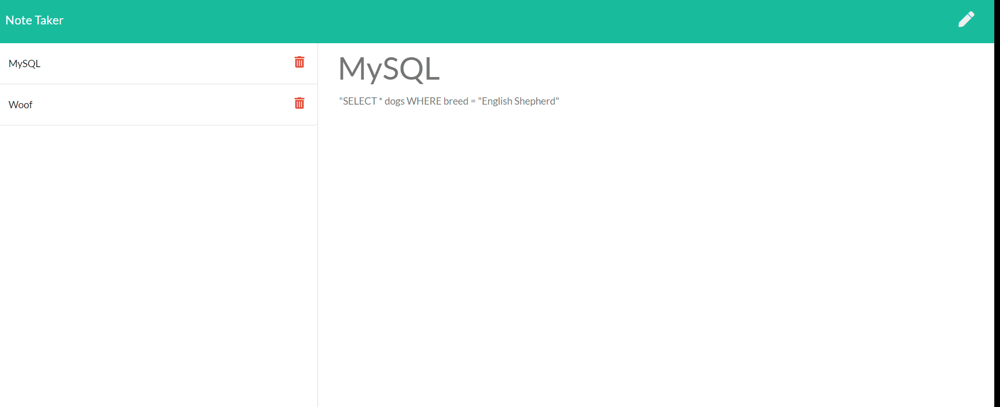

# note-taker

## Description 
A simple note taking app built on an express server deployed to Heroku. The user can save a not, view old notes, and delete notes. All data is stored in a single JSON database, with each note assigned a unique id number upon creation. 

## Live App
https://beacheynotetaker.herokuapp.com/

## Demonstration

## Usage 
This app is primarily for demonstration purposes, as there is no permanent storage if you use the launched version on Heroku—once the Heroku server shuts down, when you reopen the app it will display the default notes in its stored json database file. 

